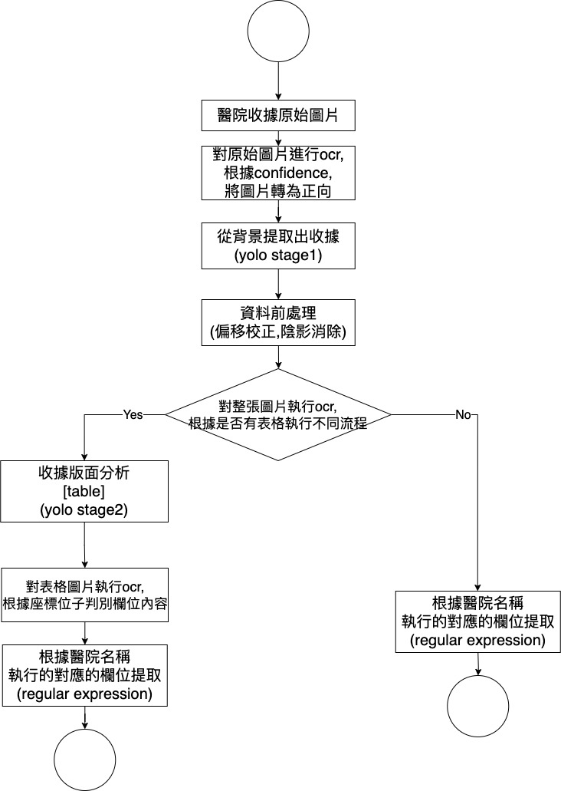
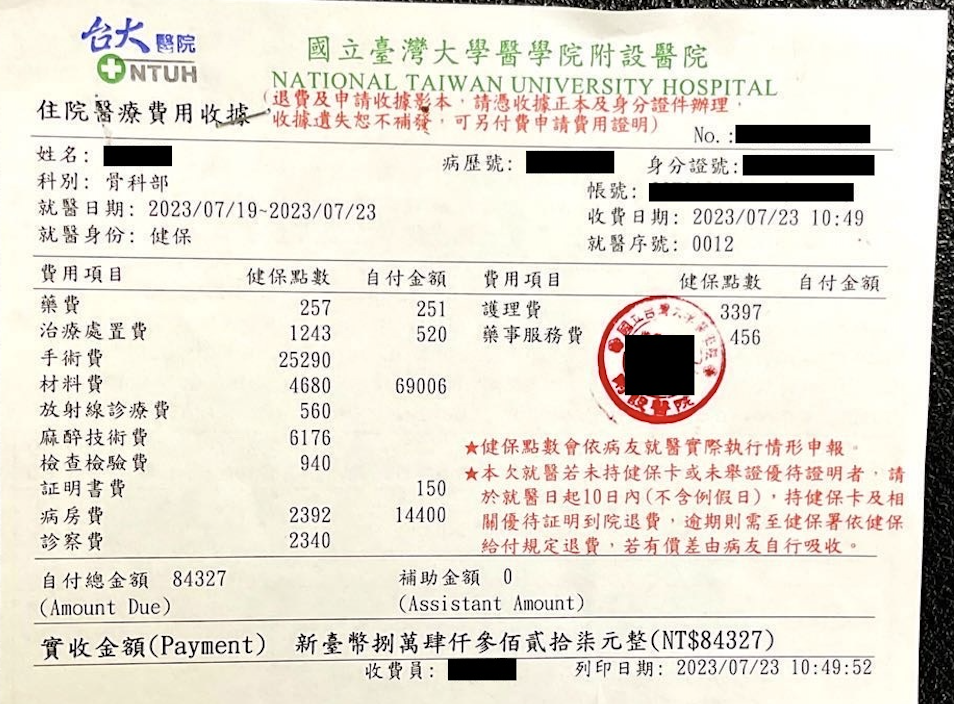
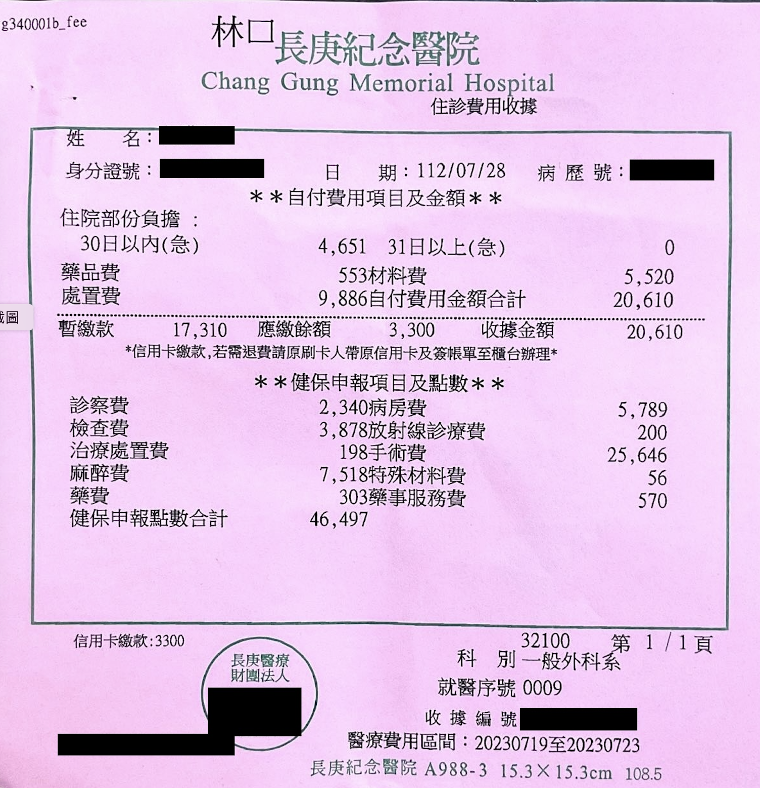
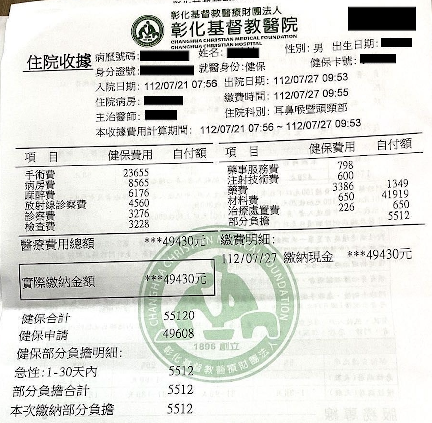

# Receipt OCR API

# Getting Started
```
# 1
cd src
make
```

## output:
```
"23080115660001_006!@!300014.jpg" : {
    'nhi': 'Y', 
    'admissionDate': '2023/07/09', 
    'dischargeDate': '2023/07/17', 
    'hospitalName': '彰化基督教醫療財團法人彰化基督教醫院', 
    'dept': '胃腸肝膽內科', 
    'receivedAmount': '12540', 
    'items': {  '預繳行動支付': '16254',
                '麻醉費': '330',
                '病房費': '10800', 
                '膳食費': '90',
                '證明書費': '1000'}
    } ,
```

## Key features


* OCR模型使用paddleOCR模型進行微調
  
新增醫院流程都是相似的,只需要區分醫院收據是否包含表格
1. 訓練第一個yolo模型，從背景中偵測到收據
2. 訓練第二個yolo模型，從收據偵測出表格
3. 針對醫院目標欄位,建立regex_map

## 資料夾中程式碼功能
* receipt  
    * correct_skew_folder_shadow_pool； 校正圖片歪斜與陰影
    * crop_tt_folder；切割第二個yolo模型偵測到的收據區塊
    * crop_yolo_folder；切割第一個yolo模型偵測到的收據圖片
    * extract_info_from_Chang_Geng；提取出目標欄位,長庚醫院(沒有表格)
    * extract_info_from_NTU；提取出目標欄位,台大醫院(有表格)
    * extract_info_from_CHANGHUA_CHRISTIAN；提取出目標欄位,彰基醫院(有表格)
    * hospital_info_from_text；對應到完整的醫院名稱
    * ocr_pipeline.py；執行ocr模型

* receipt_loc.py；本地端收據ocr主程式,讀取圖片並輸出結果

## receipt_loc.py

1. 加載ocr模型,yolo_stage1,yolo_stage2模型
2. 讀取圖片,進行去陰影處裡
3. 對圖片執行ocr,根據信心值判斷圖片是否為正向,同時判別醫院名稱
4. 使用yolo_stage1,擷取出收據圖片
4. 對收據圖進行前處理(歪斜校正)(process_image)
5. 對收據圖整體進行ocr(ocr_sentence),依據醫院名稱走不同流程
6. 有表格,使用第二個yolo模型偵測出表格位子,並且抓取表格內容,
    第五步驟中的ocr結果進行regular expression提取出欄位,
    將兩者合併,最後得到目標項欄位.
7. 無表格,第五步驟中的ocr結果進行regular expression提取出欄位,
    最後得到目標項欄位.

## 範例
### 台大收據

```
"台大收據1.jpg" : {
    'nhi': 'Y', 
    'admissionDate': '2023/07/19', 
    'dischargeDate': '2023/07/23', 
    'hospitalName': '國立臺灣大學醫學院附設醫院', 
    'dept': '骨科部', 
    'receivedAmount': '84327', 
    'items': {  '藥費': '251',
                '治療處置費': '520',
                '材料費': '69006', 
                '證明書費': '150',
                '病房費': '14400'}
    } ,
```
### 長庚收據

```
"長庚收據1.jpg" : {
    'nhi': 'Y', 
    'admissionDate': '2023/07/28', 
    'dischargeDate': '2023/07/28', 
    'hospitalName': '林口長庚紀念醫院', 
    'dept': '一般外科系', 
    'receivedAmount': '20610', 
    'items': {  '住院部分負擔': '4651',
                '藥品費': '553',
                '材料費': '5520', 
                '處置費': '9886',}
    } ,
```
### 彰基收據

```
"彰基收據1.jpg" : {
    'nhi': 'Y', 
    'admissionDate': '2023/07/21', 
    'dischargeDate': '2023/07/27', 
    'hospitalName': '彰化基督教醫療財團法人彰化基督教醫院', 
    'dept': '耳鼻喉暨頭頸部', 
    'receivedAmount': '49430', 
    'items': {  '藥費': '1349',
                '材料費': '41919',
                '治療處置費': '650', 
                '部分負擔': '5512',
                }
    } ,
```